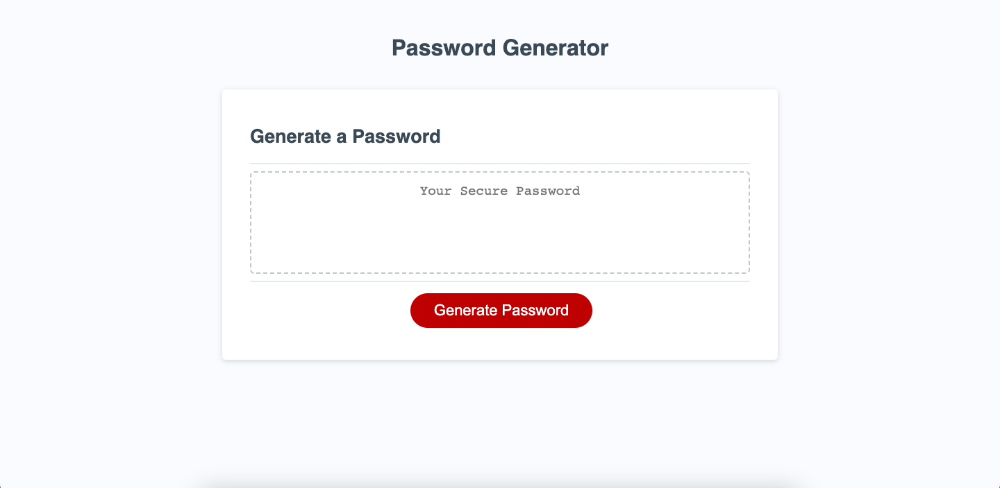

# JavaScript Challenge: Password Generator

This project is all about working with JavaScript by developing a simple password generator. We were provided with a html and css template, and we were tasked with generating the JavaScript variables and function to complete the task.

The web appplication generates a random password by asking the user to choose a password length between 8 and 128 characters. Once a password length has been set, the application asks the user more questions about what to include in the generated password. Should the generator include Lower case, Upper case characters? Should it include Numbers or Special characters?

The Javascript converts the password length to a number, checks if the number is within 8 - 128 characters. It then checks if any of the character requirements are to be included. If no options are set or if the password length is not correct, the function alerts the user to the issue and end the function.

If all of the requirements have been met, the password generator function will generate a random password. It loops through the set password length, randomly sets each character as either a lowercase, uppercase, number, or special character based on the choices of the user.

The randomly generated password is set to the dom set with the id tag password by running the function writePassword() via an addEventListener.

[Link to working example](https://xclusive36@github.io/friendly-parakeet/)
